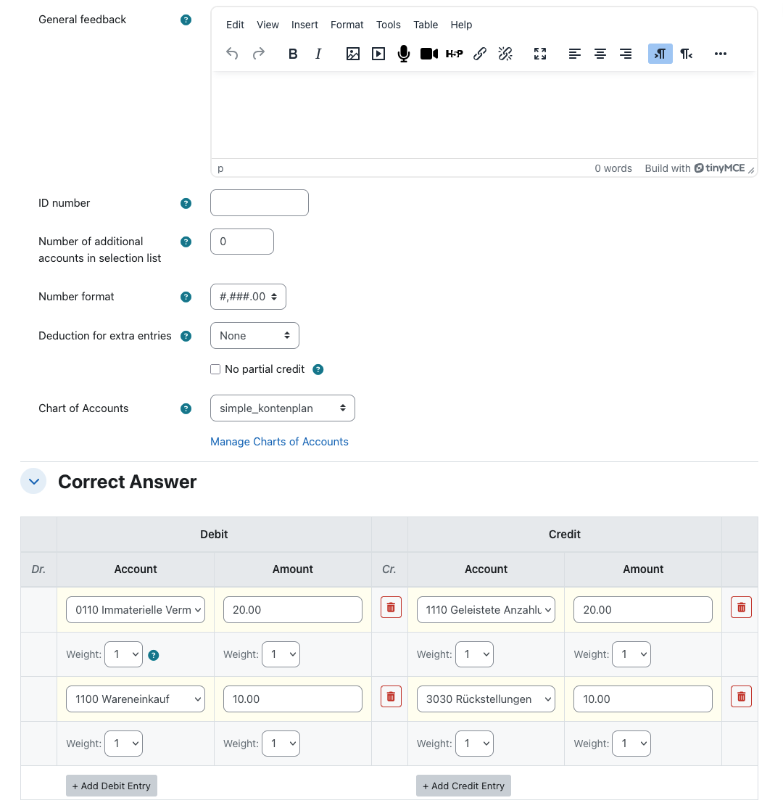
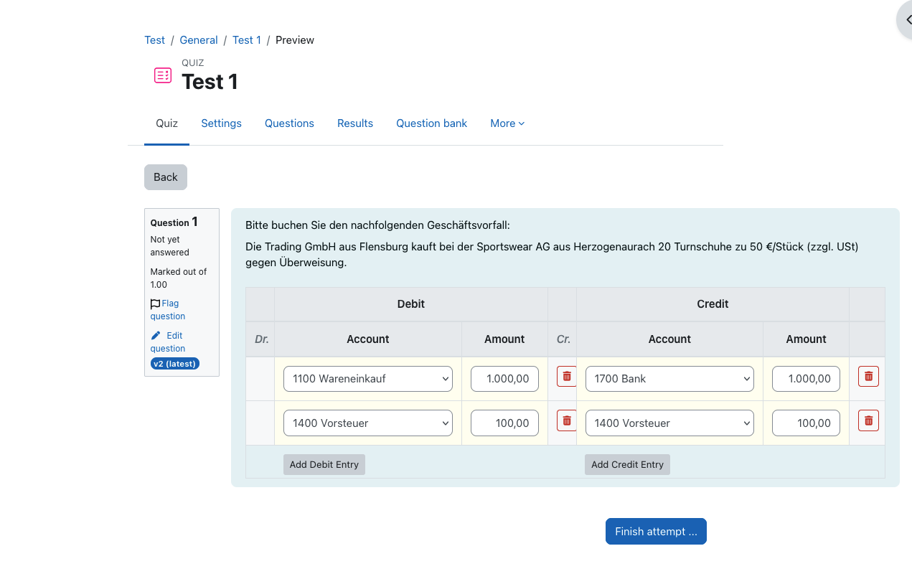
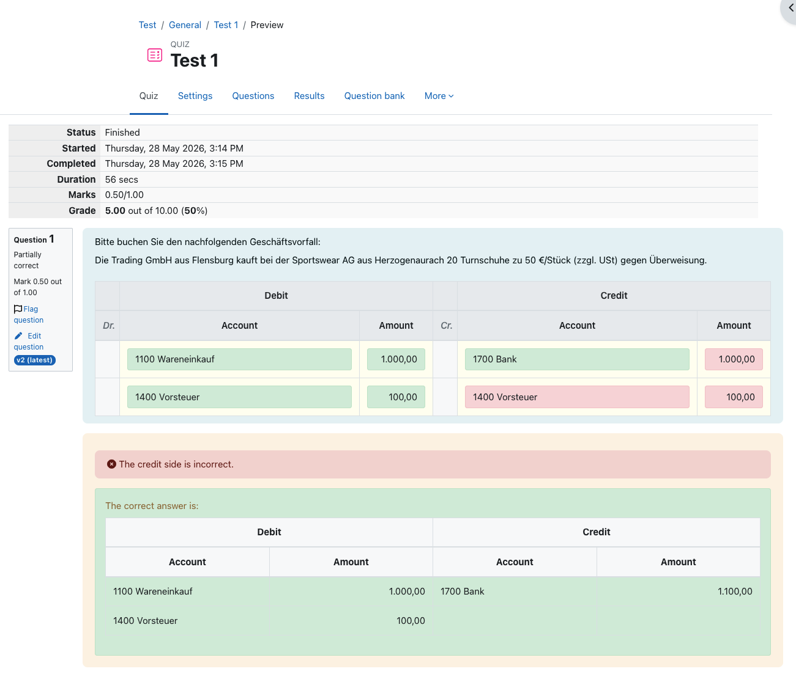

# Accounting Entry (Buchungssatz) question type for Moodle

A Moodle question type for practising double-entry bookkeeping. Students record one or more journal entries (Buchungssätze) by picking debit and credit accounts from a course-scoped chart of accounts and entering amounts. Grading is weighted per field, with an optional all-or-nothing mode and an optional penalty for extra entries.

Developed for **Hochschule Flensburg** by **lambda9**.

> **Plugin name:** `qtype_accounting` &nbsp;•&nbsp; **Current release:** 1.0.0 (stable) &nbsp;•&nbsp; **License:** GNU GPL v3 or later

---

## Contents

- [Screenshots](#screenshots)
- [Features](#features)
- [Requirements](#requirements)
- [Installation](#installation)
- [Quick start](#quick-start)
- [Authoring a question](#authoring-a-question)
- [Managing charts of accounts](#managing-charts-of-accounts)
- [Grading model](#grading-model)
- [Question import/export](#question-importexport)
- [Backup and restore](#backup-and-restore)
- [Capabilities](#capabilities)
- [Privacy](#privacy)
- [Database tables](#database-tables)
- [Internationalisation](#internationalisation)
- [Bug reports and support](#bug-reports-and-support)
- [Development](#development)
- [Repository layout](#repository-layout)
- [Terminology](#terminology)
- [License](#license)
- [Credits](#credits)

---

## Screenshots

### Authoring a question

Teachers pick a chart of accounts, configure grading behaviour, and add one or more correct-answer entries. Each entry has independent weights for Debit Account, Debit Amount, Credit Account, and Credit Amount, so you can decide how much each field contributes to partial credit.



### Student attempt

Students see one combined table with a Debit side and a Credit side. Account dropdowns are populated from the question's chart of accounts (with an optional set of decoy accounts), and rows can be added or removed on either side.



### Feedback after submission

After submission, every field is highlighted individually — green for correct, red for incorrect. A side-level summary explains what's wrong, and the full correct answer is rendered underneath.



---

## Features

### For students

- Two-sided entry table (Debit / Credit), one journal-entry row at a time.
- Add or remove rows independently on each side.
- Searchable account dropdowns when the theme provides Select2; native `<select>` otherwise.
- Optional decoy accounts in dropdowns to discourage process-of-elimination guessing.
- Responsive mobile card layout for narrow viewports.
- Per-field feedback colouring after submission with a side-level summary message.
- Full correct-answer view rendered alongside the student's response.

### For instructors

- Multiple correct-answer entries per question — supports compound bookings (e.g., split-VAT).
- **Per-field weighting** — Debit Account, Debit Amount, Credit Account, Credit Amount each get an independent weight of 1, 2, or 3, used in the partial-credit calculation.
- **No partial credit** option — flips grading to all-or-nothing.
- **Deduction for extra entries** — configurable percentage penalty per extra account the student names that isn't part of the correct answer; each side is counted independently, score is floored at 0.
- **Decoy accounts in dropdowns** — "Number of additional accounts in selection list" controls how many random extra accounts appear alongside the correct ones. `0` shows the entire chart.
- **Number format toggle** — `1,234.56` (US) or `1.234,56` (DE).
- Course-scoped charts of accounts, manageable directly from the question form.
- CSV import and export of charts of accounts (one account per line; UTF-8 or Windows-1252).
- Question import and export through Moodle's standard XML format, with the embedded chart of accounts travelling with the question.
- Backup and restore as part of a course's question bank.

---

## Requirements

- **Moodle 4.5 LTS** or later (build `2024100700`+). Verified against branches **4.5 LTS through 5.1**.
- **PHP 8.1** or later (8.2 recommended).
- A supported database — verified against **MariaDB 10.11** and **PostgreSQL 16**.

The plugin has no external service dependencies. It does not require Composer, Node, or any third-party hosted service to run.

---

## Installation

### From a release ZIP (recommended for production)

1. As a site administrator, go to **Site administration → Plugins → Install plugins**.
2. Upload the release ZIP and follow the prompts. Moodle will validate the plugin and continue to the upgrade screen.
3. Click **Upgrade Moodle database now**.
4. The plugin is now installed; no further configuration is required.

### From source

1. Place the plugin source so that `version.php` sits at `<moodledir>/question/type/accounting/version.php`.
2. As a site administrator, visit **Site administration → Notifications**. Moodle will detect the new plugin and run `install.xml`.

The plugin has no admin settings page — all configuration is per-question, and charts of accounts are scoped to courses.

---

## Quick start

1. In any course, create or open a quiz.
2. **Add → A new question → Accounting Entry (Buchungssatz)**.
3. In the question form, click **Manage Charts of Accounts** to create your first chart for the course (or upload one as a CSV). Each line of the CSV is one account name, e.g.:
   ```
   1200 Bank
   1400 Receivables
   3400 Purchases
   1576 Input VAT
   1600 Payables
   8400 Sales (19% VAT)
   ```
4. Return to the question form, pick the chart you just created, then add one or more correct-answer entries.
5. Save. The question is now in the course's question bank and can be added to any quiz.

---

## Authoring a question

The question form follows Moodle's standard layout. The accounting-specific section adds:

| Option | Default | Description |
|---|---|---|
| Chart of Accounts | *(none)* | The chart students will pick accounts from. Required. |
| Number of additional accounts in selection list | `0` | Decoys per dropdown. `0` = show all accounts from the chart; `n` = correct account plus `n` random ones. |
| Number format | `1.234,56` (DE) | Decimal/thousands separators shown to students. |
| Deduction for extra entries | None | Percentage subtracted per extra account the student names that isn't in the correct answer. |
| No partial credit | Off | If on, the question grades 0 or full marks only. |

Below those options is the **Correct Answer** table. Each row contributes to grading; you can:

- Add as many rows as you need with **Add Debit Entry** / **Add Credit Entry**.
- Set the four per-field weights for each row (1, 2, or 3) — these become the inputs to the partial-credit calculation described below.
- Delete a row with the trash button on either side.

---

## Managing charts of accounts

Charts are stored per **course context**, so each course has its own list and one course's charts don't appear in another's question forms.

You reach the management page from within the question authoring form: when you create or edit an Accounting Entry question, click **Manage Charts of Accounts** in the chart selector. The page requires the `qtype/accounting:managecharts` capability, granted to `manager` and `editingteacher` by default.

On the management page you can:

- **Upload a CSV** to create a new chart. The filename becomes the chart name; one account per line.
- **Edit** a chart to rename it and add, edit, delete, or reorder accounts.
- **Download** any chart as CSV.
- **Delete** a chart (with confirmation).

CSV files may be UTF-8 or Windows-1252 (Excel's default); a UTF-8 BOM, if present, is stripped automatically.

---

## Grading model

`classes/scorer.php` aggregates entries by `(side, account)` rather than matching rows positionally. This means the order in which a student types their entries does not matter — only the totals per account on each side. The flow is:

1. **Aggregate the correct answer.** Sum amounts and per-field weights, grouped by `(side, account)`.
2. **Aggregate the student's response** the same way.
3. **Score each correct `(side, account)` pair.**
   - The **account weight** is awarded if the student named that account on that side at all.
   - The **amount weight** is awarded if the student's summed amount for that pair is within `0.01` of the correct sum.
4. **Apply penalties.** Subtract the configured percentage per extra account the student named that isn't in the correct answer (each side counted independently). Final score is floored at 0.
5. **All-or-nothing.** If **No partial credit** is enabled, snap the result to 0 or 1.

Notes:

- Account-name matching is case-insensitive (matching is by account ID after lookup).
- Floating-point amount comparison uses a `0.01` tolerance.
- Re-grading after edits is supported via Moodle's standard re-grade mechanism.

---

## Question import/export

The plugin extends Moodle's XML format. Exporting a question writes its options, all correct-answer entries (with weights and explanations), and the **full chart of accounts** the question references. Importing the question recreates or reuses an existing chart with matching accounts in the destination context, so questions move between courses and sites without losing their account list.

Use **Question bank → Export** / **Import** as you would for any other question type, picking **Moodle XML format**.

---

## Backup and restore

The plugin implements both backup and restore via `backup/moodle2/`. Course backups include questions of this type along with their referenced chart of accounts. Restoring a course recreates the chart in the target course's context (deduplicating against any matching existing chart).

---

## Capabilities

| Capability | Default roles | Risk | Purpose |
|---|---|---|---|
| `qtype/accounting:managecharts` | `manager`, `editingteacher` | `RISK_CONFIG` | Create, edit, upload, download, and delete charts of accounts at course level. |

Authors of questions inherit existing Moodle question capabilities (`moodle/question:add`, etc.) — no extra capability is needed to write Buchungssatz questions beyond standard Moodle quiz/question permissions.

---

## Privacy

The plugin stores no personal data beyond the `usermodified` audit column on `qtype_accounting_charts`. The Privacy API provider at `classes/privacy/provider.php` implements:

- `get_metadata()` — declares the single tracked column.
- `get_contexts_for_userid()`, `get_users_in_context()` — list contexts and users with chart-modification history.
- `delete_data_for_all_users_in_context()`, `delete_data_for_user()`, `delete_data_for_users()` — clear the audit column when requested.

Student responses are stored by Moodle's question engine itself, not by this plugin, and are handled by core's privacy provider.

---

## Database tables

All tables are prefixed `qtype_accounting_`:

| Table | Purpose |
|---|---|
| `qtype_accounting_charts` | Chart definitions: `name`, `contextid`, timestamps, `usermodified`. |
| `qtype_accounting_accounts` | Accounts inside a chart: `chartid`, `accountname`, `sortorder`. |
| `qtype_accounting_options` | Per-question options: chart selection, decoy count, number format, grading flags, max entries. |
| `qtype_accounting_entries` | Correct-answer rows: account IDs and amounts per side, per-field weights, optional explanation. |

All schema changes go through `db/upgrade.php`.

---

## Internationalisation

The release ships English strings only, per Moodle policy. German is maintained alongside in this repository for the development environment but is excluded from release ZIPs (`lang/de/` is `export-ignore`d in `.gitattributes`).

To contribute a translation, please use the official Moodle translation tool at <https://lang.moodle.org/>.

---

## Bug reports and support

- **Issues:** please file bug reports and feature requests against the project's issue tracker.
- **Contact:** <info@lambda9.de>.

When reporting a bug, please include:

- Your Moodle version (Site administration → Notifications shows it).
- Your PHP version and database engine.
- The version of this plugin (Site administration → Plugins → Plugins overview).
- Steps to reproduce, expected behaviour, and observed behaviour.

---

## Development

The `dev/` directory contains a complete Dockerised dev/CI environment. It is `export-ignore`d in `.gitattributes` and does not ship in the release ZIP.

### Bring up the stack

```bash
# MariaDB-backed (default)
./dev/scripts/start.sh

# PostgreSQL-backed — required for Moodle plugin contribution checklist cross-DB verification
./dev/scripts/start-pgsql.sh
```

Both stacks serve Moodle at <http://localhost:8080>. The Postgres stack overlays `dev/docker-compose.pgsql.yml`.

### Test suites

```bash
./dev/scripts/test.sh              # PHPUnit + Behat
./dev/scripts/test.sh phpunit
./dev/scripts/test.sh behat
```

### Lint and static analysis

```bash
./dev/scripts/ci.sh                # full CI: tests + every check
./dev/scripts/ci.sh checks         # lint set only
./dev/scripts/ci.sh codecheck      # phpcs (moodle + moodle-extra)
./dev/scripts/ci.sh codecheck fix  # phpcbf auto-fix
./dev/scripts/ci.sh grunt          # eslint + stylelint + gherkinlint + rollup
```

The container ships `moodle-cs` and `moodle-plugin-ci` ready to run.

### Building the AMD modules

```bash
./dev/scripts/build.sh             # minify amd/src → amd/build (uses terser)
```

Commit `amd/build/` alongside any `amd/src/` change — CI's grunt step compares the two and fails if they drift. For local iteration without rebuilding on every edit, set `$CFG->cachejs = false;` in `dev/docker/config.php`.

### Coding standards

The project follows the [Moodle Coding Style Guide](https://moodledev.io/general/development/policies/codingstyle), enforced by `moodle` + `moodle-extra` phpcs rulesets (`.phpcs.xml.dist`) and a customised PHPMD ruleset (`.phpmd.xml`).

For deeper architectural notes, see [`dev/CLAUDE.md`](dev/CLAUDE.md).

---

## Repository layout

```
moodle-qtype_accounting/                 # Plugin root; unpacks to question/type/accounting/
├── amd/
│   ├── src/                             # ES module sources
│   │   ├── editform.js                  # Authoring form behaviour
│   │   ├── entry_utils.js               # Shared helpers
│   │   ├── mobile_layout.js             # Card layout for narrow viewports
│   │   └── question.js                  # Student quiz interaction
│   └── build/                           # Minified output (committed)
├── backup/moodle2/                      # Backup + restore handlers
├── classes/                             # PSR-4 autoloaded under qtype_accounting\
├── db/
│   ├── access.php                       # Capability definitions
│   ├── install.xml                      # XMLDB schema
│   └── upgrade.php                      # Per-version DB migrations
├── docs/screenshots/                    # README screenshots
├── lang/
│   ├── en/qtype_accounting.php          # English (shipped)
│   └── de/qtype_accounting.php          # German (dev-only; export-ignored)
├── pix/icon.svg                         # Question-type icon
├── tests/
│   ├── behat/                           # Acceptance tests
│   ├── generator/                       # Test data generator
│   ├── question_test.php                # PHPUnit: grading
│   └── questiontype_test.php            # PHPUnit: save/load + XML
├── edit_accounting_form.php             # Question authoring form
├── edit_chart.php                       # Edit a single chart's accounts
├── manage_charts.php                    # Course-scoped chart list
├── question.php                         # qtype_accounting_question
├── questiontype.php                     # qtype_accounting (question_type)
├── renderer.php                         # qtype_accounting_renderer
├── styles.css                           # .qtype_accounting-* selectors
├── version.php
├── README.md                            # This file
├── CHANGES.md
├── LICENSE
└── dev/                                 # Dev tooling — not shipped in release ZIP
```

---

## Terminology

| German | English |
|---|---|
| Buchungssatz | Journal entry / accounting entry |
| Soll | Debit |
| Haben | Credit |
| Konto | Account |
| Betrag | Amount |
| Kontenrahmen / Kontenplan | Chart of accounts |
| SKR03 | Standard German chart of accounts (a popular preset, not bundled) |

---

## License

This plugin is licensed under the [GNU General Public License v3 or later](LICENSE).

```
Copyright (C) 2024 Hochschule Flensburg / lambda9.

This program is free software: you can redistribute it and/or modify
it under the terms of the GNU General Public License as published by
the Free Software Foundation, either version 3 of the License, or
(at your option) any later version.
```

---

## Credits

Developed for **Hochschule Flensburg** by **lambda9**.

Contact: <info@lambda9.de>
